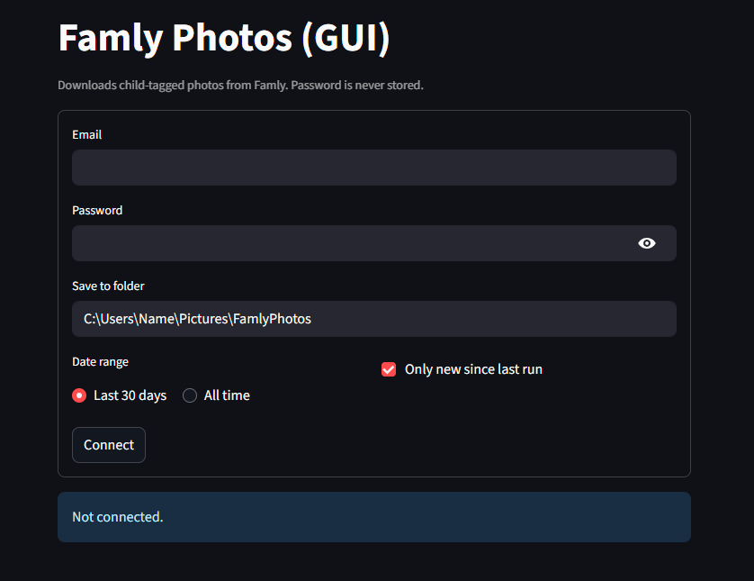

# Famly Fetch GUI

Fetch your (kid's) images from famly.co

Download children’s photos from **Famly** using either:
- the **original CLI** (Docker or manual), or
- a **Streamlit GUI** (pick a folder, date range, and “only new since last run”).

> **Privacy:** Your **password is never stored**. The GUI can optionally remember your **email** via the OS keychain. Authentication reuses the repo’s existing login flow (same as the CLI), keeping the session in memory/cookies only for the current run.

Shoutout to the original creator (jacobbunk) https://github.com/jacobbunk/famly-fetch/tree/main

---

## Requirements

- **Python:** **3.11** (recommended). Streamlit/Protobuf can be finicky on 3.12/3.13.
    - You might get a few shell errors from Streamlit but don't worry about those if you choose to run it manually.
- **Pip / venv:** standard Python tooling.
- **GraphQL files present** (must exist for both CLI and GUI):
  
      src/famly_fetch/graphql/
        Authenticate.graphql
        LearningJourneyQuery.graphql
        GetChildNotes.graphql
        __init__.py          # must exist (can be empty)

- **Endpoint:** defaults to `https://app.famly.co/graphql`. For Germany use `https://app.famly.de/graphql`.

  Set/override via environment variable if necessary via:

  - macOS/Linux (bash/zsh)

        export FAMLY_GRAPHQL_ENDPOINT="https://app.famly.co/graphql"

  - Windows (PowerShell)

        $env:FAMLY_GRAPHQL_ENDPOINT = "https://app.famly.co/graphql"

---

# Get Started

## Quick Start — Manual (original CLI)
```
pip install famly-fetch
famly-fetch
```

Enter your email and password when prompted. Run `famly-fetch --help` to
get full help page.

Downloaded images will be stored in the `pictures` directory of the
the folder where you run this program from.

By default, it will only download images where you have tagged your child. The
date that the photo was taken is embedded in its metadata and in its title.
For journey, notes and messages, the associated text is also added as an exif
comment.

The images have been stripped for any metadata including EXIF
information by Famly.

The `--stop-on-existing` option is helpful if you wish to download
images continously and just want to download what is new since last
download.

If you have issues with this method like with dependancies, I'd recommend you use Docker, see below.

## Command Line Help

```bash
Usage: famly-fetch [OPTIONS]

  Fetch kids' images from famly.co

Options:
  --email EMAIL                   Your famly.co email address, can be set via
                                  FAMLY_EMAIL env var  [required]
  --password PASSWORD             Your famly.co password, can be set via
                                  FAMLY_PASSWORD env var  [required]
  --no-tagged                     Don't download tagged images
  -j, --journey                   Download images from child Learning Journey
  -n, --notes                     Download images from child notes
  -m, --messages                  Download images from messages
  -p, --pictures-folder DIRECTORY
                                  Directory to save downloaded pictures, can
                                  be set via FAMLY_PICTURES_FOLDER env var
                                  [default: pictures]
  -e, --stop-on-existing          Stop downloading when an already downloaded
                                  file is encountered
  --version                       Show the version and exit.
  --help                          Show this message and exit.
```


## Quick Start — Docker (original CLI)

From the repository root:

``` bash
    docker-compose build 
    docker compose run app
```

Your famly.co email address, can be set via FAMLY_EMAIL env var
Your famly.co password, can be set via FAMLY_PASSWORD env var

If not, you will be prompted like so:

``` bash
➜  docker compose run app
WARN[0000] The "FAMLY_EMAIL" variable is not set. Defaulting to a blank string. 
WARN[0000] The "FAMLY_PASSWORD" variable is not set. Defaulting to a blank string. 
[+] Creating 1/1
 ✔ Network famly-fetch-gui_default  Created                                                0.0s 
Enter your famly.co email address: 
Enter your famly.co password:
```

---

## Streamlit GUI (interactive)

### 1) Install with GUI extras (in a Python 3.11 venv)

macOS / Linux:

``` bash
    python3.11 -m venv .venv
    source .venv/bin/activate
    python -m pip install -U pip setuptools wheel
    pip install -e .[gui]
```

Windows (PowerShell):

``` Powershell
    py -3.11 -m venv .venv
    .\.venv\Scripts\Activate.ps1
    python -m pip install -U pip setuptools wheel
    pip install -e .[gui]
```

If you ever see a Streamlit runtime error like:
`TypeError: 'str' object cannot be interpreted as an integer`,
pin to a stable combo (still inside the venv):

``` bash
    pip uninstall -y streamlit protobuf blinker
    pip install "protobuf<5" "blinker<1.8" "streamlit==1.32.2"
```

### 2) Launch the GUI

Recommended (ensures the correct endpoint):

macOS / Linux:
``` bash
    export FAMLY_GRAPHQL_ENDPOINT="https://app.famly.co/graphql"  # or .de
    python -m famly_fetch.gui.bootstrap
```
Windows (PowerShell):
``` Powershell
    $env:FAMLY_GRAPHQL_ENDPOINT = "https://app.famly.co/graphql"
    python -m famly_fetch.gui.bootstrap
```
Alternatively (after `pip install -e .[gui]`):

``` bash
    famly-fetch-gui
```

> On Windows, ensure you run the **venv’s** copy, this should be automatic though but just in case:
>
>     .\.venv\Scripts\famly-fetch-gui.exe

### 3) Using the GUI

- **Login:** enter email + password (password is not stored; email can be remembered via keychain).
- **Folder:** defaults to `~/Pictures/FamlyPhotos`; choose another if you like.
- **Filters:**
  - Date range: **Last 30 days** or **All time**
  - Source: **Learning Journey** and/or **Notes**
  - **Only new since last run:** skips previously downloaded IDs (tracked in `~/.famly_fetcher/state.json`)
- **Progress & Resume:** live counts; you can cancel and resume later.



---

## PyInstaller (single executable)

You can build a one‑file executable for non‑technical users.

### Ensure data files are bundled

- In `pyproject.toml`:

      [tool.setuptools.package-data]
      "famly_fetch.graphql" = ["*.graphql"]

- Make sure `src/famly_fetch/graphql/__init__.py` exists.

### Build on Windows

(from repo root, inside your 3.11 venv)

    pyinstaller --noconfirm --onefile --name "FamlyPhotos-gui" `
      --collect-submodules PIL `
      --add-data "src\famly_fetch\graphql\Authenticate.graphql;famly_fetch\graphql" `
      --add-data "src\famly_fetch\graphql\LearningJourneyQuery.graphql;famly_fetch\graphql" `
      --add-data "src\famly_fetch\graphql\GetChildNotes.graphql;famly_fetch\graphql" `
      src\famly_fetch\gui\bootstrap.py

The binary will be in `dist/FamlyPhotos-gui[.exe]`.

### Build on macOS / Linux

    pyinstaller --noconfirm --onefile --name "FamlyPhotos-gui" \
      --collect-submodules PIL \
      --add-data "src/famly_fetch/graphql/Authenticate.graphql:famly_fetch/graphql" \
      --add-data "src/famly_fetch/graphql/LearningJourneyQuery.graphql:famly_fetch/graphql" \
      --add-data "src/famly_fetch/graphql/GetChildNotes.graphql:famly_fetch/graphql" \
      src/famly_fetch/gui/bootstrap.py

The binary will be in `dist/FamlyPhotos-gui`.


---

## Troubleshooting

- **Missing `.graphql` at runtime**  
  Check each `--add-data` path and that the destination is `famly_fetch/graphql`.
- **GUI opens but buttons don’t respond**  
  Build with **Python 3.11**; if needed, pin `protobuf<5`, `blinker<1.8`, `streamlit==1.32.2`.
- **“Stuck on logging in…”**  
  Use Python **3.11** + the pinned versions above. Launch from the venv (`python -m famly_fetch.gui.bootstrap`).
- **403 “You need to login” on GraphQL**  
  Ensure the GUI runs through the repo’s login flow (not raw GraphQL auth) and that `FAMLY_GRAPHQL_ENDPOINT` matches your tenant.
- **400 Bad Request on GraphQL**  
  `LearningJourneyQuery.graphql` often requires `childId`. The GUI discovers children (same as the CLI) and queries per child.
- **No child list**  
  Some accounts expose children differently. The GUI can still fetch “All children”. If needed, adjust the client’s child discovery or add a `Me` GraphQL query.

---

## Security

- Passwords are **never persisted**.
- Session lives only in memory/cookies during the current run.